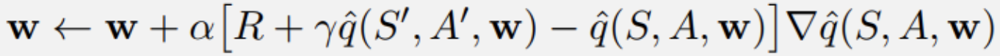
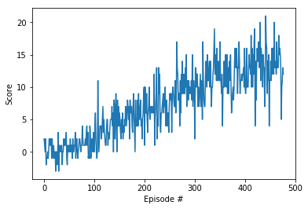
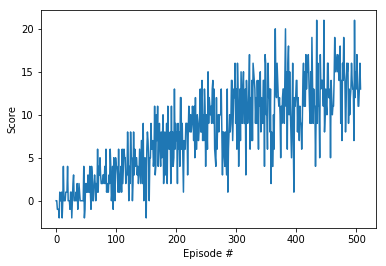

# Project 1: Navigation

Author: [Aman Dalmia](http://github.com/dalmia) 

The project demonstrates the ability of value-based methods, specifically, [Deep Q-learning](https://storage.googleapis.com/deepmind-media/dqn/DQNNaturePaper.pdf) and its variants, to learn a suitable policy in a model-free Reinforcement Learning setting using a Unity environment, which consists of a continuous state space of 37 dimensions, with the goal to navigate around and collect yellow bananas (reward: +1) while avoiding blue bananas (reward: -1). There are 4 actions to choose from: move left, move right, move forward and move backward. A agent choosing actions randomly can be seen in motion below:

 

The following report is written in four parts:

- **Implementation**
- **Results**
- **Ideas for improvement** 

## Implementation

At the heart of the learning algorithm is the , [Deep Q-learning](https://storage.googleapis.com/deepmind-media/dqn/DQNNaturePaper.pdf), which surpassed human-level performance in Atari games. It is an off-policy learning algorithm where the policy being evaluated is different from the policy being learned.

To step back for a bit, the idea of Q-learning is to learn the action-value function, often denoted as          `Q(s, a)` , where `s` represents the current state and `a` represents the action being evaluated. Q-learning is a form of Temporal-Difference learning (TD-learning), where unlike Monte-Carlo methods, we can learn from each step rather than waiting for an episode to complete. The idea is that once we take an action and are thrust into a new state, we use the current Q-value of that state as the estimate for future rewards. 

  

There's one specific problem here. Since our space is continuous, we can't use a tabular representation. Hence, we use a `Function Approximator`. The idea behind a function approximator is to introduce a new parameter $\theta$ that helps us to obtain an approximation of the `Q(s, a)`, $\hat{Q} (s, a; \theta)$. So, this becomes a supervised learning problem where the approximation $\hat{Q}$ represents the expected value and $R + \gamma * max (Q(s', a))$ becomes the target. We then use mean-square error as the loss function and update the weights accordingly using gradient descent. Now, the choice remains to choose the function approximator. Enter **Deep Learning**! We use a neural network as function approximator here. More specifically, we choose a 2-hidden layer network with both the layers having 64 hidden units with `relu` activation applied after each fully-connected layer. `Adam` was used as the optimizer for finding the optimal weights:

 

However, the algorithm described above in its raw form is highly unstable. Two techniques contributed significantly towards stabilizing the training:

- **Fixed Q-targets**: As can be seen from the equation above, the target during training itself is dependent on `w`, the parameter being updated. This leads to constantly moving targets and hurts training. The idea behind fixed q-targets is to fix the parameter `w` used in the calculation of the target, $\hat{Q}(s, a; w)$. This is achieved by having two separate networks, one is the online network being learned and the other being the target network. The weights of the target network are taken from the online network itself by freezing the model parameters for a few iterations and updating it periodically after a few steps. By freezing the parameters this way, it ensures that the target network parameters are significantly different from the online network parameters.
- **Experience Replay**: This is the other important technique used for stabilizing training. If we keep learning from experiences as they come, then we are basically observed a sequence of observations each of which are linked to each other. This destroys the assumption of the samples being independent. In ER, we maintain a Replay Buffer of fixed size (say N). We run a few episodes and store each of the experiences in the buffer. After a fixed number of iterations, we sample a few experiences from this replay buffer and use that to calculate the loss and eventually update the parameters. Sampling randomly this way breaks the sequential nature of experiences and stabilizes learning. It also helps us use an experience more than once.

Both of the above mentioned techniques were incorporated. The entire implementation was done in PyTorch.  Also, various other improvements have been proposed upon the original DQN algorithm, and this repository contains the implementations of two of those:

- **Double DQN***: DQNs are known to overestimate the value function because of the `max` operator. The idea of Double DQN is to disentangle the calculation of the Q-targets into finding the best action and then calculating the Q-value for that action in the given state. The trick then is to use one network to choose the best action and the other to evaluate that action. The intuition here is that if one network chose an action as the best one by mistake, chances are that the other network wouldn't have a large Q-value for the sub-optimal action. The network used for choosing the action is the online network whose parameters we want to learn and the network to evaluate that action is the target network described earlier. More details can be found in the [paper](https://arxiv.org/abs/1509.06461).

   

- **Dueling Network**: Normally, DQNs have a single output stream with the number of output nodes equal to the number of actions. But this could lead to unnecessarily estimating the value of all the actions for states for states which are clearly bad and where, choosing any action won't matter that much. So, the idea behind dueling networks is to have two output streams, with a shared feature extractor layer. One stream outputs a single scalar value denoting the value function for that state, `V(s)` while the other stream outputs the advantage function for each action in that state `A(a, s)`. The advantage function accounts for the advantage achieved for choosing action `a` . They are combined together using a special aggregrate layer:

  $$ Q (s, a) = V(s) + (A(s, a) - 1/A * mean_a (A (s, a))$$

  The mean subtraction is done to avoid the identifiability problem and various other reasons which can be found in the [paper](). 

  ### Hyperparameters

  There were many hyperparameters involved in the experiment. The value of each of them is given below:

  | Hyperparameter                      | Value |
  | ----------------------------------- | ----- |
  | Replay buffer size                  | 1e5   |
  | Batch size                          | 64    |
  | $\gamma$ (discount factor)          | 0.99  |
  | $\tau$                              | 1e-3  |
  | Learning rate                       | 5e-4  |
  | update interval                     | 4     |
  | Number of episodes                  | 500   |
  | Max number of timesteps per episode | 2000  |
  | Epsilon start                       | 1.0   |
  | Epsilon minimum                     | 0.1   |
  | Epsilon decay                       | 0.995 |

  #Results

   

  The trained agent can be seen in action below:

   

  The best performance was achieved by **Double DQN** where the reward of +13 was achieved in **377** episodes. It was a bit confusing to see that Dueling Double DQN wasn't the best one but I attribute it to the fact that I didn't do a hyperparameter search for the same and instead used the same hyperparameter setting. The plots of the rewards for the different variants of DQN is shown below:

| Double DQN                                 | DQN                                | Dueling DQN                                         |
| ------------------------------------------ | ---------------------------------- | --------------------------------------------------- |
|  |  |  |

## Ideas for improvement

- Using Prioritized Replay ([paper](https://arxiv.org/abs/1511.05952)) showed a massive improvement over Double DQNs for Atari games. It is expected that it'll lead to an improved performance here too.
- Other improvements to the original DQN algorithms that were briefly mentioned in the course could be  potentially beneficial too: learning from [multi-step bootstrap targets](https://arxiv.org/abs/1602.01783) , [Distributional DQN](https://arxiv.org/abs/1707.06887), [Noisy DQN](https://arxiv.org/abs/1706.10295)
- Hyperparameter search for both Double DQNs and Dueling Double DQNs should lead to better performance too.