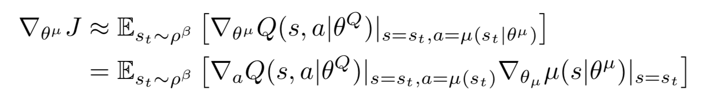
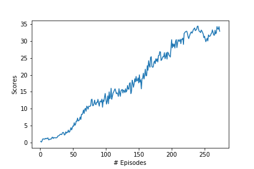

# Project 2: Continuous Control

Author: [Aman Dalmia](http://github.com/dalmia) 

The project demonstrates how policy-based methods can be used to learn the optimal policy in a model-free Reinforcement Learning setting using a Unity environment, in which a double-jointed arm can move to target locations. A reward of +0.1 is provided for each step that the agent's hand is in the goal location. Thus, the goal of the agent is to maintain its position at the target location for as many time steps as possible.

The observation space consists of 33 variables corresponding to position, rotation, velocity, and angular velocities of the arm. Each action is a vector with four numbers, corresponding to torque applicable to two joints. Every entry in the action vector is a number between -1 and 1. An agent choosing actions randomly can be seen in motion below:

 

The following report is written in four parts:

- **Implementation**

- **Results**

- **Ideas for improvement** 

  

## Implementation

The basic algorithm lying under the hood is an actor-critic method. Policy-based methods like REINFORCE, which use a Monte-Carlo estimate, have the problem of high variance. TD estimates used in value-based methods have low bias and low variance. Actor-critic methods marry these two ideas where the actor is a neural network which updates the policy and the critic is another neural network which evaluates the policy being learned which is, in turn, used to train the actor.

In vanilla policy gradients, the rewards accumulated over the episode is used to compute the average reward and then, calculate the gradient to perform gradient ascent. Now, instead of the reward given by the environment, the actor uses the value provided by the critic to make the new policy update.

[Deep Deterministic Policy Gradient (DDPG)](https://arxiv.org/abs/1509.02971) lies under the class of Actor Critic Methods but is a bit different than the vanilla Actor-Critic algorithm. The actor produces a deterministic policy instead of the usual stochastic policy and the critic evaluates the deterministic policy. The critic is updated using the TD-error and the actor is trained using the deterministic policy gradient algorithm.

  

Since we are dealing with 20 agents, I went ahead with updating the weights after every 20 steps and for every such step, updating the weights 10 times. There are also a few techniques which contributed significantly towards stabilizing the training:

- **Fixed targets**: Originally introduced for DQN, the idea of having a fixed target has been very important for stabilizing training. Since we are using two neural networks for the actor and the critic, we have two targets, one for actor and critic each. 
- **Soft Updates**: In DQN, the target networks are updated by copying all the weights from the local networks after a certain number of epochs. However, in DDPG, the target networks are updated using soft updates where during each update step, 0.01% of the local network weights are mixed with the target networks weights, i.e. 99.99% of the target network weights are retained and 0.01% of the local networks weights are added.
- **Experience Replay**: This is the other important technique used for stabilizing training. If we keep learning from experiences as they come, then we are basically observed a sequence of observations each of which are linked to each other. This destroys the assumption of the samples being independent. In ER, we maintain a Replay Buffer of fixed size (say N). We run a few episodes and store each of the experiences in the buffer. After a fixed number of iterations, we sample a few experiences from this replay buffer and use that to calculate the loss and eventually update the parameters. Sampling randomly this way breaks the sequential nature of experiences and stabilizes learning. It also helps us use an experience more than once.

All of the above mentioned techniques were incorporated. The entire implementation was done in PyTorch. 

Also, in my experience, I have found Batch normalization to have always improved training and hence, I added one Batch normalization layer in both actor and critic. Upon trying out both ReLU and Leaky ReLU, I found the latter to work better and hence, 

### Hyperparameters

There were many hyperparameters involved in the experiment. The value of each of them is given below:

| Hyperparameter                      | Value |
| ----------------------------------- | ----- |
| Replay buffer size                  | 1e6   |
| Batch size                          | 1024  |
| $\gamma$ (discount factor)          | 0.99  |
| $\tau$                              | 1e-3  |
| Actor Learning rate                 | 1e-4  |
| Critic Learning rate                | 3e-4  |
| Update interval                     | 20    |
| Update times per interval           | 10    |
| Number of episodes                  | 500   |
| Max number of timesteps per episode | 1000  |
| Leak for LeakyReLU                  | 0.01  |

  #Results

   

  The trained agent can be seen in action below:

   

  The best performance was achieved by **DDPG** where the reward of +30 was achieved in **[Insert]** episodes. I noticed how changing every single hyperparameter contributes significantly towards getting the right results and how hard it is to identify the ones which work. The plot of the rewards across episodes is shown below:

  

## Ideas for improvement

- Using Prioritized Replay ([paper](https://arxiv.org/abs/1511.05952)) has generally shown to have been quite useful. It is expected that it'll lead to an improved performance here too.

- Other algorithms like TRPO, PPO, A3C, A2C that have been discussed in the course could potentially lead to better results as well.

- The Q-prop algorithm, which combines both off-policy  and on-policy learning, could be good one to try.

- General optimization techniques like cyclical learning rates and warm restarts could be useful as well.

  