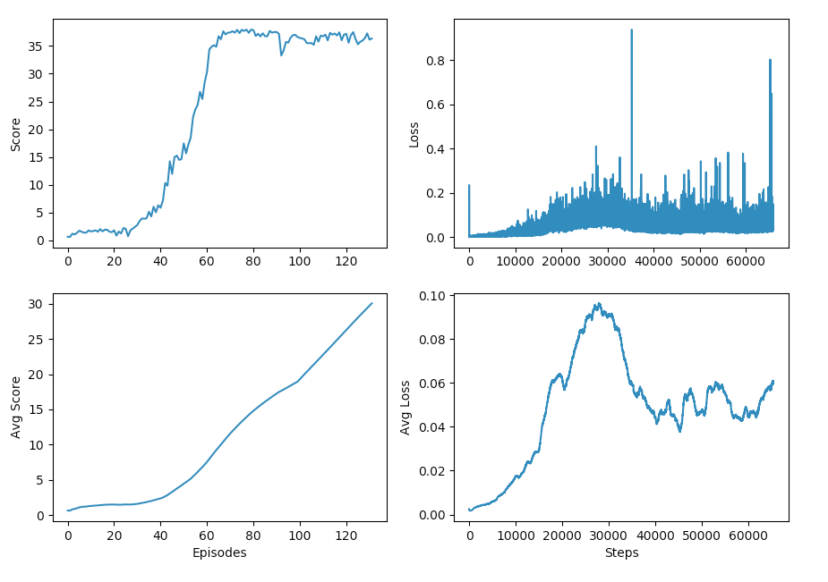

## Learning Algorithm
The algorithm chosen to solve this environment is Deep Deterministic Policy Gradient (DDPG).  DDPG can be seen as an extension of DQN, with three important enhancements:
 1. It works with continuous action spaces, key for solving robotic control problems.
 2. It uses an actor-critic model, using value based methods to reduce the variance of policy based methods.
 3. It is easily parallelized, further reducing variance and speeding up training.

#### Hyperparameters
The chosen hyperparameters closely follow those from the original [DDPG paper](https://arxiv.org/abs/1509.02971).  This includes:
  - Two layer networks, 400 hidden units in the first, 300 in the second, for both actor and critic models.
  - Relu activation for all non linear activation functions.
  - Actions added in second layer of the critic.
  - Adam optimizer with learning rates of 1e-4 for the actor and 1e-3 for the critic.
  - Soft target update parameter tau of 1e-3.
  - Discount factor gamma of 0.99.

A few changes were made all of which were found to speed up training:
  - L2 weight_decay of the critic set to 0.0001 vs 0.01 in the paper.
  - Batch size of 128 vs 64.
  - Update gradients every 2 steps vs every step.

#### Key improvement
The best improvement however came from using a normal distribution (`np.random.randn`) when adding randomness to the Ornstein-Uhlenbeck process.  The code provided for the Ornstein-Uhlenbeck process used a uniform distribution (`random.random()`) and had much worse performance.  A normal distribution is consistent with other [implementations](https://github.com/openai/baselines/blob/10c205c1596dd58d1a9b33d423fb75228fe03953/baselines/ddpg/noise.py) and [references](https://math.stackexchange.com/questions/1287634/implementing-ornstein-uhlenbeck-in-matlab).

## Plot of Rewards
Using the supplied hyperparameters the agent is able to solve the environments in 32 episodes.  There are also [detailed training results](assets/training_output.txt) if you are curious.

## Ideas for Future Work
Other enhancements that I did not have time to explore but may yield promising results:
  - Add noise to the policy parameters.  There is [evidence](https://blog.openai.com/better-exploration-with-parameter-noise/) that this can boost performance.
  - Use the [PPO](https://arxiv.org/abs/1707.06347) algorithm.  A policy gradient method that is also very effective, though it would have to be adapted for continuous action spaces.
  - Use prioritized experience replay.  The current implementation of PER is not efficient enough to use with large buffer sizes, it needs to be reworked, but could be another way to solve the environment in fewer episodes.
  - A thorough hyperparameter grid search.  Time and money constraints prevented an exhaustive hyperparameter search.

## Other considerations
It's also worth noting that it is fairly easy to reduce the number of episodes to solve the environment by increasing the `batch_size` or decreasing the `update_every` (number of steps that pass before doing a gradient update).  But this results in an increased wall time.  I would argue that wall time is a better metric then number of episodes or number of steps when evaluating the agent's performance.  Of course this muddles comparisons across different hardware but should be fine for comparisons on the same hardware.
